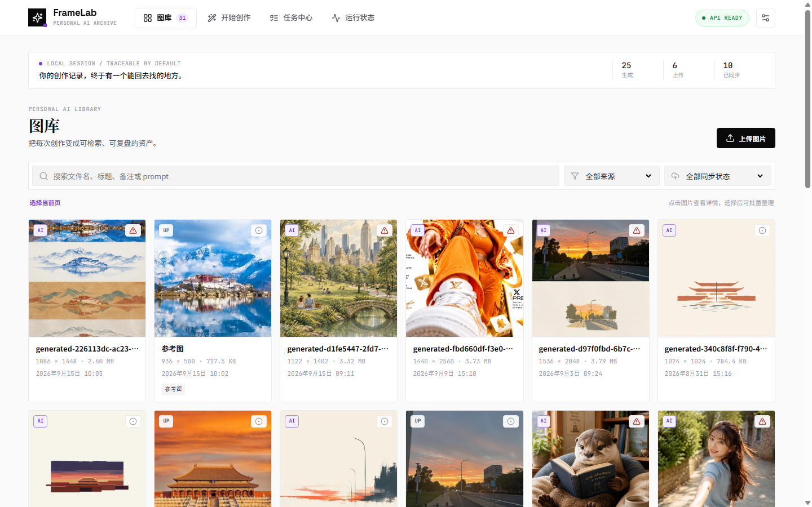
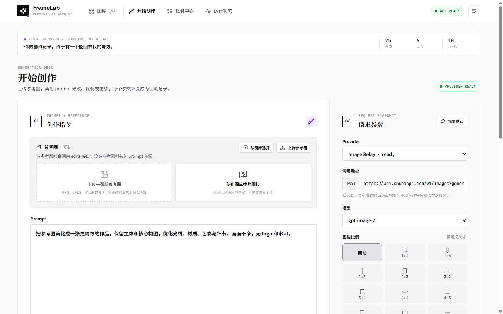
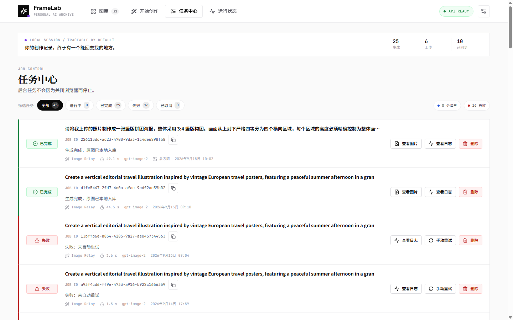
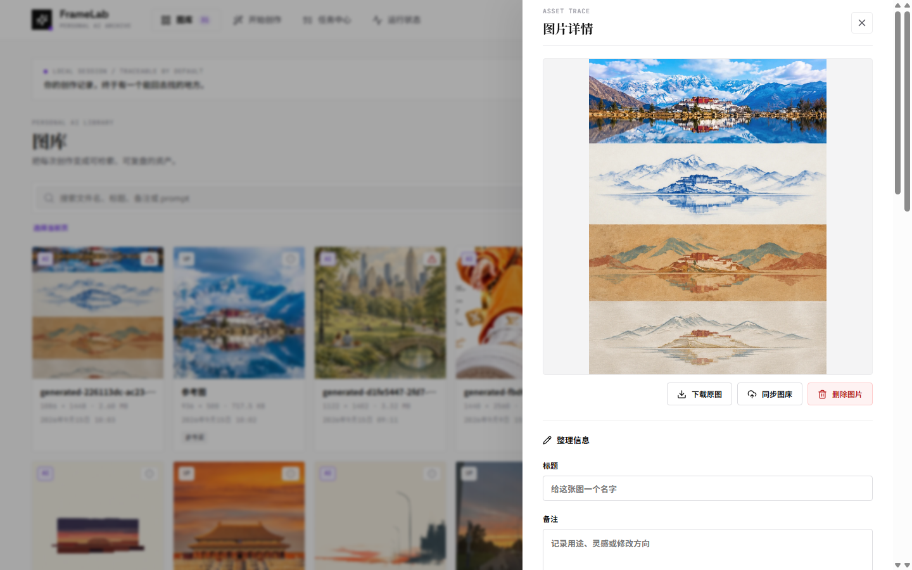
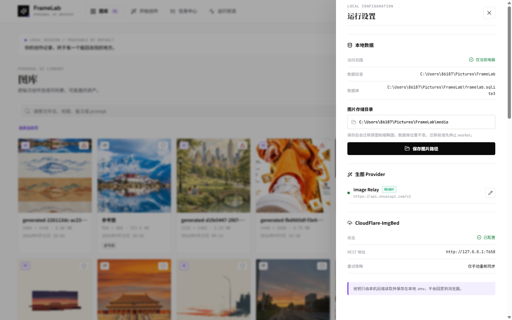

# FrameLab

FrameLab 是一个仅在本机运行的个人 AI 图库与创作回溯工作台。它把上传图片和生成图片统一保存到本地，并记录原始 prompt、provider、模型、请求参数、任务状态、耗时、父任务和图床同步信息。

---

## 界面展示

界面已全面采用 **Quiet Signal 核心视觉规范** 重构，注重编辑性排版、近白表面与克制的高对比度语义信号。

### 1. 个人 AI 图库 (Gallery View)
按时间倒序展示已保存与生成的资产，支持快速筛选来源（AI 生成 / 本地上传）、图床同步状态（已同步 / 待同步 / 失败 / 仅本地）及关键词搜索；支持批量打标签、同步与整理。



### 2. 创作工作台 (Generation Desk)
左右双栏结构。左侧为创作指令与参考图上传（支持图生图改图、局部修改与风格迁移），右侧为完整的请求参数快照配置（模型、尺寸、画幅比例、质量、超时限制与端点地址）。



### 3. 任务调度中心 (Job Center)
SQLite 持久队列调度。清晰展示任务处理状态、耗时统计、生成参数及 Task ID 追溯，支持查看实时事件日志、手动重试与结果直达。



### 4. 资产详情与回溯抽屉 (Asset Trace)
原图无损预览与元数据沉浸式回顾。完整呈现原始 Prompt、生成参数快照（模型、尺寸、耗时、上游 Task ID）、参考图追溯链条及生成生命周期事件时间线。



### 5. 运行设置与 Provider 管理 (Settings)
支持在网页端直接修改与配置生图 Provider 的 Base URL 与 API Key（自动更新 SQLite 并安全持久化至本地 `.env`，即时热重载生效，密钥不回显至浏览器），并支持图片物理存储目录的一键安全迁移。



---

## UI 设计参考与规范体系 (Quiet Signal)

本项目整体 UI 与 CSS 严格遵循 **Quiet Signal Core Visual Specification (`references/SPEC.md`)** 设计规范：

> **Quiet Signal 是一种安静、清晰、克制，但具有明确识别信号的视觉语言。**
> 它以近白表面、黑色信息层级、编辑性字体关系、细线分组和有限紫色为核心，让内容显得经过判断，而不是经过装饰。

### 核心设计原则
1. **信号优先于装饰**：每一个醒目的视觉元素都具备明确的功能指示（状态提示、当前选中、主提交），杜绝多余的渐变、荧光霓虹与装饰性噪点。
2. **层级优先于容器**：优先使用字号、字重、邻近度和空间网格组织信息，仅在存在真实交互边界时才增加表面容器。
3. **紫色必须有语义**：采用单一核心信号紫（`#7C3AED`），专用于主操作、焦点边界（Focus Ring）及选中态，禁止无节制作为背景氛围色。
4. **秩序优先于丰富**：使用精确的 1px 分割线、沉降卡片表面与直角工程化骨架构建清晰视野。

### 视觉 Token 规范
- **表面与底色 (Surfaces & Canvas)**：
  - 画布底色：近白 Canvas (`#FAFAFA`)
  - 容器表面：纯白 Surface (`#FFFFFF`)
  - 沉降与次级表面：Subtle Sunken (`#F4F4F5`)
  - 边界线条：1px Clean Border (`#E4E4E7` / `#ECECEE`)
- **墨水与层级 (Inks & Typography)**：
  - **中文观点与主标题**：`Noto Serif SC`（宋体/衬线，字重 700，紧凑行高 1.15，提供深度阅读与回溯记录的杂志编辑质感）
  - **英文标题与品牌锚点**：`Space Grotesk`（无衬线，字重 700）
  - **技术元数据与代码**：`JetBrains Mono`（等宽字体，字距 0.06em，0.75x 尺度，用于 Task ID、参数、时间戳与尺寸）
  - **主要墨水**：`#0A0A0A`（高对比主标题与重要数据）
  - **次级墨水**：`#52525B`（正文、说明文字）
  - **弱化墨水**：`#A1A1AA`（元数据、辅助标签）
- **功能状态色 (Subdued States)**：
  - 成功：`#15803D`（低饱和纯净绿）
  - 失败/危险：`#B91C1C`（沉稳红）
  - 警告/注意：`#B45309`（琥珀橙）
  - 同步中/信息：`#1D4ED8`（沉着蓝）
- **几何体系 (Hybrid Geometry)**：
  - 大结构（导航顶栏、抽屉、工作台主体）：**直角（0px）**
  - 独立元素（按钮、输入框、图片缩略图、浮层）：**微圆角（4px）**

---

## 当前功能特性

- **现代 Quiet Signal 界面**：React + TypeScript + 精细化 CSS 构建的高质感单页应用。
- **全格式无损归档**：PNG、JPEG、WebP、GIF 原图与缩略图本地存储。
- **SQLite 持久任务队列**：后台 worker 异步轮询，关闭浏览器后任务继续平稳运行。
- **OpenAI 兼容异步 Provider**：
  - 纯文本生图固定走 `/images/generations/async`；
  - 参考图改图、局部修改与风格迁移走 `/images/edits/async` multipart（参考图字段为 `image[]`）；
  - 支持在设置抽屉中实时编辑 Base URL 与 API Key，持久化到 `.env` 并即时热生效；
  - 支持 `gpt-image-2`、`gpt-image-2.5`、`gpt-image-2-2k`、`gpt-image-2-4k` 等多模型参数选择。
- **可靠的状态恢复机制**：不重复提交任务；若查询连接意外中断，worker 恢复后继续等待原上游任务。
- **父子任务衍生链路**：支持基于历史任务 ID 继续派生生成，完整记录上下文迭代谱系。
- **CloudFlare-ImgBed 图床同步**：支持按需自动上传或手动批量同步，提供安全容错与状态追踪。
- **完整资产元数据**：SHA-256 哈希、尺寸、文件体积、生成耗时、请求快照与全生命周期事件日志。

---

## 快速启动

### 1. 配置环境变量

复制配置模板并填写根目录下的 `.env`：

```powershell
Copy-Item .env.example .env
```

```dotenv
CODEX_IMAGE_API_KEY=你的APIKey
CODEX_IMAGE_BASE_URL=https://example.com/v1
```

> 💡 **提示**：启动后也可以直接在网页右上角「运行设置」中图形化配置 Base URL 与 API Key，无需手动修改文件。

如需使用 CloudFlare-ImgBed 图床同步功能，可在 `.env` 中补充：

```dotenv
FRAMELAB_IMGBED_BASE_URL=http://127.0.0.1:8080
FRAMELAB_IMGBED_API_TOKEN=imgbed_...
```

### 2. 一键运行

双击 `start.cmd`，或在 PowerShell 中执行：

```powershell
.\start.ps1
```

默认访问地址：<http://127.0.0.1:8765>

首次运行会自动创建 `.venv` 虚拟环境、安装 Python 依赖并编译前端生产包。
数据文件默认存储在 `%USERPROFILE%\Pictures\FrameLab`，与代码库完全分离。可在 `.env` 中通过 `FRAMELAB_DATA_DIR` 或 `FRAMELAB_MEDIA_DIR` 自定义路径。

---

## 项目结构

```text
framelab/              FastAPI 后端、SQLite 数据库、worker 轮询器与适配器
web/                   React + TypeScript 前端工程
  src/                 组件、API 客户端与 Quiet Signal 样式表
docs/                  项目文档与展示资源
  images/              README 展示截图
tests/                 全套 pytest 自动化测试套件（使用 mock，无需真实外部消耗）
server.py              本地 API 服务入口（支持 --reload 热重载）
start.ps1              一键自动化启动脚本（支持依赖安装、编译与守护）
start.cmd              Windows 快速启动入口
```

---

## 开发与测试

运行后端测试套件与前端类型构建检查：

```powershell
# 后端测试
python -m pytest -q

# 前端类型检查与生产构建
npm run build --prefix web
```
